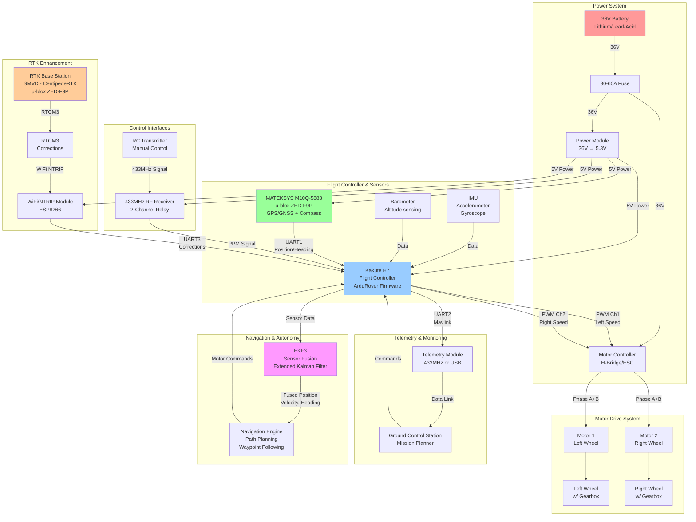
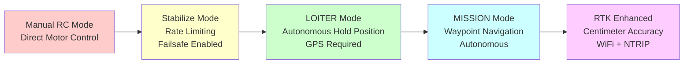
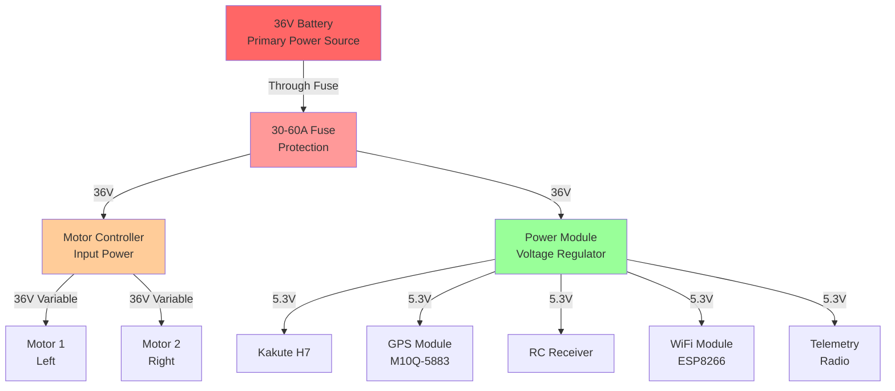
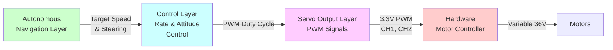

# System Architecture Diagram

## Rover System Overview (Mermaid)



## Operating Modes



## Power Distribution Flow



## Communication Protocol Stack



---

## Hardware Connections Summary

| Component | Connection | Signal | Voltage |
|-----------|-----------|--------|---------|
| **Battery** | Power Module IN | 36V DC | 36V |
| **Motor 1 (Left)** | Motor Controller OUT | Phase A+B | 36V variable |
| **Motor 2 (Right)** | Motor Controller OUT | Phase A+B | 36V variable |
| **GPS/Compass** | FC UART1 | TX/RX | 3.3V |
| **RC Receiver** | FC RC IN | PPM | 3.3V |
| **WiFi Module** | FC UART3 | TX/RX | 3.3V |
| **Telemetry** | FC UART2 | TX/RX | 3.3V |
| **Motor Controller** | FC CH1, CH2 | PWM | 3.3V |
| **Power Module** | FC 5V Pin | 5V regulated | 5.3V |

---

## Signal Flow During Autonomous Mission

```
1. GPS Satellite Network
   ↓
2. M10Q-5883 Module (receives raw GNSS signals)
   ↓
3. Flight Controller (UART1 raw position data)
   ├─ EKF3 Sensor Fusion
   │  ├─ IMU (accelerometer, gyroscope)
   │  ├─ Barometer
   │  ├─ Compass (magnetometer)
   │  └─ GPS (position, velocity)
   └─ Fused State Estimate
   ↓
4. Navigation Engine
   ├─ Reads current position
   ├─ Calculates error from waypoint
   └─ Generates motor commands
   ↓
5. Control Loop (Attitude Controller)
   ├─ Speed controller (throttle)
   ├─ Steering controller (left/right differential)
   └─ Rate limiting (smooth acceleration)
   ↓
6. PWM Output (CH1, CH2)
   ↓
7. Motor Controller
   ├─ Interprets PWM duty cycle
   ├─ Generates phase signals
   └─ Drives motors with variable power
   ↓
8. Motors + Wheels
   └─ Rover moves toward waypoint
```

---

## RTK Signal Flow

```
1. RTK Base Station (SMVD - CentipedeRTK)
   ├─ Fixes position precisely
   └─ Calculates correction messages
   ↓
2. RTCM3 Stream (correction data)
   ↓
3. WiFi Module on Rover (ESP8266)
   ├─ Requests corrections via NTRIP
   └─ Forwards RTCM3 to flight controller
   ↓
4. Flight Controller (UART3)
   ├─ Receives RTCM3 messages
   └─ Applies corrections to GPS solution
   ↓
5. u-blox ZED-F9P Module
   ├─ Blends raw GPS + RTK corrections
   └─ Achieves 2-5cm accuracy (vs 1-2m standard GPS)
   ↓
6. EKF3 Fusion
   ├─ Trusts corrected position more (tighter gates)
   └─ Smoother, more accurate navigation
   ↓
7. Autonomous Mission
   └─ Follows within ±5cm of planned path (100x improvement!)
```

---

## Typical Mission Sequence

```
START: Battery connected, outdoors with clear sky

↓ (0 seconds)
Power-up: FC boots, all sensors initialize
↓
GPS Acquiring: Satellites appearing (3-6 found)
↓
IMU Calibration: Accelerometer/gyroscope baseline
↓ (30 seconds)
GPS Lock: Good position fix (gps_status = 3)
↓
Compass Calibrated: Ready for heading control
↓ (60 seconds)
Arm: Switch to MISSION mode, pre-arm checks pass
↓
Load Mission: Waypoints uploaded and verified
↓ (120 seconds)
Start Motor: First waypoint engagement
↓
Navigate: EKF fused sensors guide rover
↓
Heading Control: Compass maintains direction
↓
Speed Control: Smooth acceleration ramping
↓
Obstacle Avoidance: (if enabled) Detects and avoids
↓
Waypoint Reached: Circle tightens, moves to next
↓
[Repeat for all waypoints]
↓
Return to Home: Final waypoint to launch location
↓
Land: Throttle to zero, kill motors
↓
Complete: Mission finished, ready for next

TOTAL MISSION TIME: Variable (waypoint spacing dependent)
```

---

## See Also

- [ROVER_SYSTEM_OVERVIEW.md](ROVER_SYSTEM_OVERVIEW.md) - System architecture details
- [WIRING_GUIDE.md](../documents/WIRING_GUIDE.md) - Detailed wiring instructions
- [ARDUROVER_PARAMETERS.md](../documents/ARDUROVER_PARAMETERS.md) - Parameter tuning
